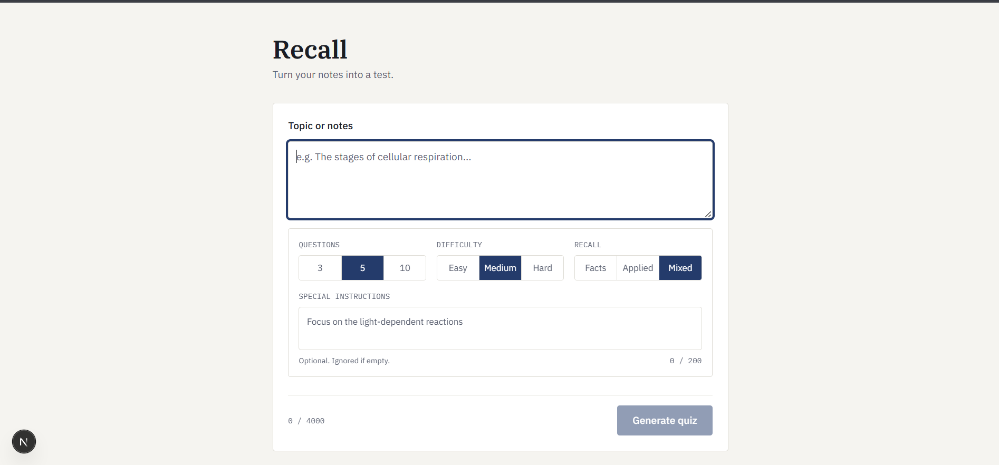
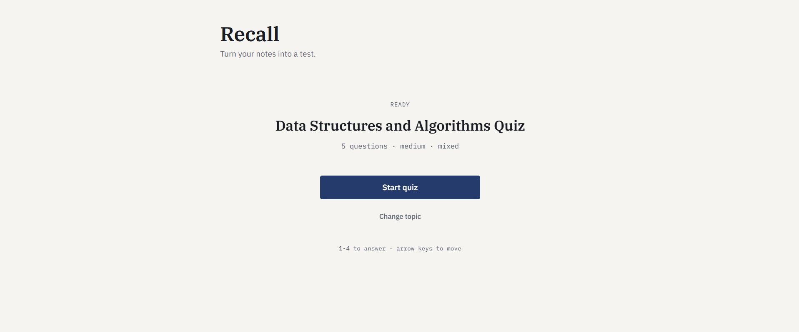
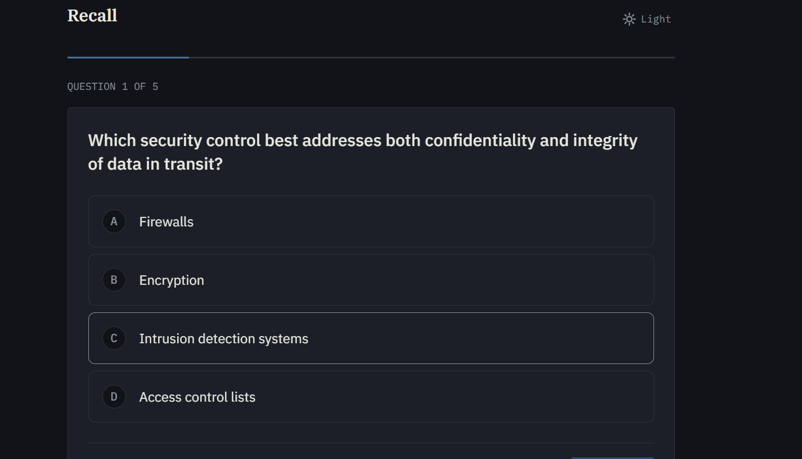
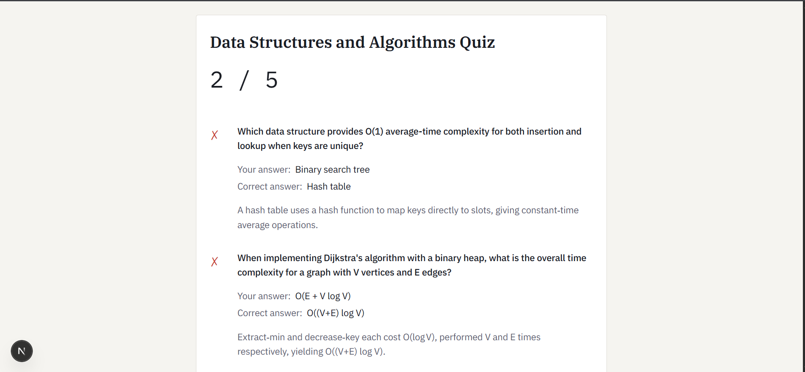

# Recall
Turn your notes into an active-recall test.

## Overview
Recall is a web application that generates custom multiple-choice quizzes from user-provided notes or topics. It is driven by a core active-recall loop: provide a topic, generate a quiz via the Groq API, and iteratively retest only the incorrect answers until a perfect score is achieved. This project was built as a take-home software engineering assignment, demonstrating rigorous state management, API proxying, and extensive error handling for unpredictable LLM outputs.

## Demo
[ADD DEMO VIDEO LINK HERE]

### Screenshots






## Setup

1. **Clone and Install**
   Clone the repository to your local machine and install the dependencies:
   ```bash
   git clone [ADD REPO URL HERE]
   cd recall
   npm install
   ```

2. **Environment Configuration**
   Copy the example environment file:
   ```bash
   cp .env.example .env.local
   ```
   Open `.env.local` and add your `GROQ_API_KEY`. You can obtain a free API key from [console.groq.com](https://console.groq.com/).

3. **Run the Application**
   Start the development server:
   ```bash
   npm start
   ```
   *(Note: The `start` script is deliberately aliased to `next dev` in `package.json` to allow running the app in development mode with `npm install && npm start`.)*

## How it works
1. **Input**: The user inputs a topic and optional configuration (question count, difficulty, style, and special instructions).
2. **Server-side Proxy**: The request is sent to a Next.js API route (`/api/generate`) to keep the Groq API key secure and off the client.
3. **LLM Generation**: The proxy requests a structured JSON response from the `openai/gpt-oss-120b` model.
4. **Validation and Salvage**: The raw text is returned to the client and parsed. A strict validator (`lib/validate.js`) checks the shape. Instead of discarding the entire payload if a single constraint is violated, malformed questions are individually dropped (partial-question salvage).
5. **Retry Logic**: If the JSON is completely unparseable or lacks the required array structure, the client initiates exactly one automatic repair retry.
6. **Quiz Loop**: Once validated, the quiz is presented. The user answers questions, views results, and can choose to retest only the questions they answered incorrectly.

## Design decisions

* **`json_object` over strict `json_schema` mode**: The generation route intentionally requests standard `json_object` rather than a strictly enforced `json_schema`. This deliberately preserves a real failure surface for the client-side validator to handle. While this trades some raw generation reliability, it allows the application to demonstrate robust partial-salvage logic and error handling.
* **Single status string**: The application state machine (`useQuiz.js`) relies on a single string (`idle`, `loading`, `ready`, `empty`, `error`) instead of independent boolean flags (`isLoading`, `isError`, etc.). This cleanly eliminates impossible UI states (like being simultaneously loading and in an error state) and forces deterministic rendering.
* **`AbortController` paired with a `requestId` guard**: When a user cancels or supersedes a request, `AbortController` cancels the network request over the wire. However, if the response was already in the microtask queue, an abort alone would not stop subsequent state updates. The `requestId` ref ensures that any async continuation strictly validates its identity before modifying React state.
* **Server-side control re-validation**: Even though generation parameters (count, difficulty, style) are selected via a constrained, trusted UI, the `/api/generate` endpoint re-validates and normalizes these inputs against strict arrays. This defends the public-facing endpoint against manual manipulation outside the client app.
* **Scaling `max_tokens`**: The route scales `max_tokens` linearly with the requested question count (`Math.max(400 * parsedCount, 2000)`). If this were hardcoded to a static limit, larger quizzes would consistently truncate mid-JSON, resulting in unparseable output and cascading failures.

## Handling bad AI output
Handling unpredictable LLM output is a primary focus of this architecture. The app explicitly handles the following failure modes:

* **Malformed/unparseable JSON**: Caught immediately by `JSON.parse`. Triggers one silent repair retry; if it fails again, it halts with a clear `BAD_MODEL_OUTPUT` error.
* **Wrong-shaped JSON**: A valid JSON object that fails domain constraints (e.g., missing fields, 5 options instead of 4, invalid `correctIndex`). The validator drops only the specific invalid questions. The valid ones are kept, and the `droppedCount` is actively surfaced to the user on the Ready screen.
* **Fewer valid questions than requested**: If the model provides a valid array but falls short of the requested count, the exact numerical `shortfall` is computed and displayed alongside any dropped questions.
* **Zero valid questions**: If the validator strips all questions (or none were provided), the app enters a distinct `empty` state, routing to a dedicated UI component rather than a generic error crash.
* **Slow/hanging responses**: A hardcoded 25-second timeout forcefully aborts the request. *(Note: During testing, a bug was found where the app hung indefinitely because the timeout abort was caught and silently discarded like a superseded request. This was successfully patched by introducing a `timedOutRef` flag to route to a distinct `TIMEOUT` error.)*
* **Upstream/network failures**: The client distinguishes between a failure to reach the proxy (`NETWORK_ERROR`, e.g., offline) and the proxy failing to reach the LLM provider (`UPSTREAM_FAILED`, e.g., 502 Bad Gateway), displaying accurate, specific text for each.

## Limitations

* While difficulty and recall style are requested via prompt guidance, the LLM's strict compliance with these subjective metrics cannot be programmatically verified.
* Special user instructions are appended to the system prompt as strong guidance, but they are not strictly enforced at the API layer.
* Because of how `localhost` network routing works in Chromium, testing the `NETWORK_ERROR` state by toggling "Offline" mode in browser DevTools is insufficient. The proper testing methodology requires explicitly blocking the `/api/generate` Request URL in the DevTools Network tab.

## AI usage
This project was built with AI coding assistance (Google Antigravity). All architectural decisions, state management patterns, error handling strategies, and design system constraints were decided upfront and documented via hand-written specifications. The generated code was thoroughly reviewed, understood, and manually tested to ensure it met the architectural requirements, rather than being accepted blindly.

## Testing
The application underwent rigorous verification, including:
* Manual testing of all LLM failure paths via a dedicated set of backend "chaos modes" to force network failures, malformed JSON, and timeouts through the real UI.
* A deliberate race-condition test to confirm that in-flight requests superseded by new user actions resolve cleanly without tearing the UI.
* A keyboard-only accessibility pass to verify focus management and tab orders.
* Responsive layout testing targeting narrow viewports down to 360px width.
* Two real bugs (a permanent loading hang on timeouts, and a missing shortfall count in the UI layer) were caught and successfully fixed during this testing phase.
